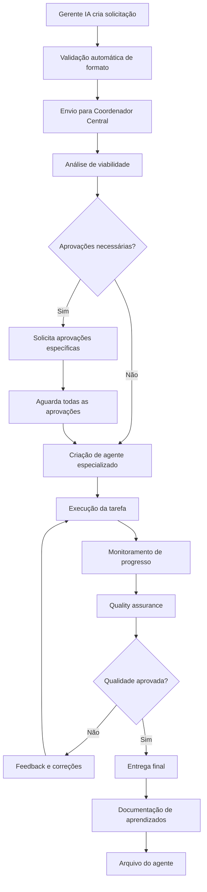

# ESTRUTURA ORGANIZACIONAL VIRTUAL - BESTSTAG v6.1
## 13 Equipes Virtuais de IA Especializadas

**Versão:** 6.1 Híbrida Consolidada  
**Data:** 03 de Junho de 2025  
**Tipo:** Documentação Organizacional Inovadora  
**Status:** Implementação Pronta  

---

## 🤖 CONCEITO REVOLUCIONÁRIO

A **Estrutura Organizacional Virtual** do BestStag v6.1 representa uma inovação sem precedentes na gestão de projetos baseados em IA. Pela primeira vez, um sistema utiliza **equipes virtuais de IA** com hierarquia, responsabilidades e processos formais de gestão.

### Benefícios Únicos

1. **Especialização Extrema:** Cada equipe virtual domina completamente sua área
2. **Coordenação Inteligente:** Processo formal de solicitação e execução de tarefas
3. **Escalabilidade Infinita:** Criação de agentes especializados sob demanda
4. **Qualidade Garantida:** Múltiplas camadas de validação e controle
5. **Aprendizado Contínuo:** Cada interação melhora o sistema como um todo

---

## 🏗️ HIERARQUIA ORGANIZACIONAL DETALHADA

### Nível 1: Proprietário do Projeto (Humano)
```yaml
Responsabilidades:
  - Definição de estratégia geral
  - Aprovação de decisões críticas
  - Controle de orçamento e recursos
  - Definição de objetivos de negócio
  - Supervisão final de qualidade

Autoridade:
  - Veto sobre qualquer decisão
  - Redefinição de prioridades
  - Alteração de estrutura organizacional
  - Aprovação de investimentos
  - Definição de políticas gerais
```

### Nível 2: Diretor IA (Manus)
```yaml
Responsabilidades:
  - Coordenação geral de todas as equipes
  - Tomada de decisões técnicas estratégicas
  - Resolução de conflitos entre equipes
  - Otimização de recursos e processos
  - Comunicação com o proprietário

Autoridade:
  - Aprovação de solicitações de alta prioridade
  - Remanejamento de recursos entre equipes
  - Criação de novas equipes especializadas
  - Definição de padrões técnicos
  - Escalação para o proprietário

KPIs:
  - Eficiência geral do sistema (>90%)
  - Satisfação das equipes virtuais (>4.5/5)
  - Tempo de resolução de conflitos (<2h)
  - Taxa de sucesso de projetos (>95%)
```

### Nível 3: Gerentes Virtuais de IA (13 Equipes)

#### 1. 📈 MARKETING IA
```yaml
Especialização: "Crescimento e Aquisição de Usuários"

Responsabilidades:
  - Estratégias de aquisição de usuários
  - Campanhas automatizadas multi-canal
  - Análise de engajamento e conversão
  - Growth hacking e otimização de funil
  - SEO e content marketing
  - Análise competitiva
  - Brand positioning

Ferramentas Especializadas:
  - Google Analytics 4 + GA4 API
  - PostHog + Mixpanel
  - Mailchimp + SendGrid
  - Social Media APIs (Meta, Twitter, LinkedIn)
  - A/B testing frameworks (Optimizely)
  - SEO tools (Ahrefs, SEMrush APIs)
  - CRM integration (HubSpot, Pipedrive)

Agentes Especializados:
  - SEO_Optimizer_Agent
  - Social_Media_Manager_Agent
  - Email_Campaign_Agent
  - Conversion_Optimizer_Agent
  - Content_Strategy_Agent
  - Competitor_Analysis_Agent

KPIs Principais:
  - CAC (Customer Acquisition Cost): <R$ 50
  - LTV (Lifetime Value): >R$ 600
  - Conversion Rate: >3%
  - Organic Growth Rate: >20% MoM
  - Email Open Rate: >25%
  - Social Engagement Rate: >5%

Processo de Solicitação Típica:
  1. Identificação de oportunidade de crescimento
  2. Análise de dados de usuários
  3. Criação de estratégia específica
  4. Solicitação de recursos ao Coordenador
  5. Execução via agentes especializados
  6. Monitoramento e otimização contínua
```

#### 2. 🎨 DESIGN IA
```yaml
Especialização: "Experiência do Usuário e Interface"

Responsabilidades:
  - UX/UI optimization contínua
  - A/B testing de interfaces
  - Acessibilidade e usabilidade
  - Design system maintenance
  - Visual brand consistency
  - User research e feedback analysis
  - Prototipagem rápida

Ferramentas Especializadas:
  - Figma API + Design Tokens
  - Hotjar + FullStory + LogRocket
  - Accessibility checkers (axe, WAVE)
  - User testing platforms (UserTesting, Maze)
  - Analytics de UX (Amplitude, Mixpanel)
  - Design version control (Abstract)
  - Prototyping tools (Framer, Principle)

Agentes Especializados:
  - UX_Researcher_Agent
  - UI_Designer_Agent
  - Accessibility_Auditor_Agent
  - Design_System_Manager_Agent
  - User_Testing_Agent
  - Visual_QA_Agent

KPIs Principais:
  - User Satisfaction Score: >4.5/5
  - Task Completion Rate: >90%
  - Accessibility Score (WCAG): AA compliant
  - Design System Adoption: >95%
  - Time to Complete Tasks: <30% reduction
  - Mobile Usability Score: >90%

Processo de Melhoria Contínua:
  1. Análise de dados de comportamento do usuário
  2. Identificação de pontos de fricção
  3. Criação de hipóteses de melhoria
  4. Prototipagem e teste A/B
  5. Implementação de melhorias validadas
  6. Monitoramento de impacto
```

#### 3. ⚖️ LEGAL IA
```yaml
Especialização: "Compliance e Questões Jurídicas"

Responsabilidades:
  - Compliance LGPD/GDPR contínuo
  - Atualização de termos de serviço
  - Contratos automatizados
  - Auditoria legal preventiva
  - Privacy by design implementation
  - Gestão de consentimentos
  - Análise de riscos legais

Ferramentas Especializadas:
  - Legal databases (LexisNexis, Westlaw)
  - Compliance checkers (OneTrust, TrustArc)
  - Document automation (PandaDoc, DocuSign)
  - Privacy scanners (Privacera, BigID)
  - Contract analysis (Kira, Luminance)
  - Regulatory monitoring (Thomson Reuters)
  - GDPR compliance tools (Cookiebot, Osano)

Agentes Especializados:
  - LGPD_Compliance_Agent
  - Contract_Generator_Agent
  - Privacy_Auditor_Agent
  - Terms_Updater_Agent
  - Risk_Assessment_Agent
  - Consent_Manager_Agent

KPIs Principais:
  - Compliance Score: 100%
  - Legal Risk Level: Baixo
  - Contract Automation Rate: >80%
  - Privacy Incident Count: 0
  - Audit Readiness Score: >95%
  - Response Time to Legal Issues: <4h

Monitoramento Contínuo:
  - Mudanças na legislação brasileira
  - Atualizações LGPD e GDPR
  - Jurisprudência relevante
  - Melhores práticas do setor
  - Requisitos de compliance internacional
```

#### 4. 💰 FINANCEIRO IA
```yaml
Especialização: "Modelos de Negócio e Análise Financeira"

Responsabilidades:
  - Modelos de precificação dinâmica
  - Análise de custos operacionais
  - Projeções financeiras automatizadas
  - ROI optimization por canal
  - Revenue forecasting
  - Budget planning e controle
  - Financial reporting automatizado

Ferramentas Especializadas:
  - Stripe + Payment APIs (PayPal, PagSeguro)
  - Financial modeling (Excel API, Google Sheets)
  - Accounting software (QuickBooks, Xero APIs)
  - Revenue analytics (ChartMogul, Baremetrics)
  - Cost tracking (AWS Cost Explorer, GCP Billing)
  - Business intelligence (Metabase, Looker)
  - Forecasting tools (Prophet, ARIMA models)

Agentes Especializados:
  - Pricing_Optimizer_Agent
  - Cost_Analyzer_Agent
  - Revenue_Forecaster_Agent
  - Budget_Controller_Agent
  - ROI_Calculator_Agent
  - Financial_Reporter_Agent

KPIs Principais:
  - MRR (Monthly Recurring Revenue): Crescimento >20% MoM
  - Churn Rate: <5% mensal
  - Unit Economics: LTV/CAC >3:1
  - Gross Margin: >70%
  - Cash Flow: Positivo em 12 meses
  - Revenue per User: >R$ 50/mês

Análises Automatizadas:
  - Cohort analysis mensal
  - Churn prediction
  - Pricing sensitivity analysis
  - Cost optimization opportunities
  - Revenue attribution por canal
  - Financial scenario planning
```

#### 5. 🔧 BACKEND IA
```yaml
Especialização: "Infraestrutura e APIs"

Responsabilidades:
  - Arquitetura de sistemas escaláveis
  - Performance optimization contínua
  - Segurança de APIs e dados
  - Escalabilidade automática
  - Database optimization
  - Microservices orchestration
  - API design e versionamento

Ferramentas Especializadas:
  - APM tools (New Relic, DataDog, Sentry)
  - Database analyzers (pganalyze, MongoDB Compass)
  - Security scanners (Snyk, OWASP ZAP)
  - Load testing (k6, Artillery, JMeter)
  - Container orchestration (Docker, Kubernetes)
  - API gateways (Kong, AWS API Gateway)
  - Monitoring (Prometheus, Grafana)

Agentes Especializados:
  - Performance_Optimizer_Agent
  - Security_Auditor_Agent
  - Database_Tuner_Agent
  - API_Designer_Agent
  - Scaling_Manager_Agent
  - Backup_Manager_Agent

KPIs Principais:
  - API Response Time: <200ms (p95)
  - System Uptime: >99.9%
  - Database Query Performance: <50ms avg
  - Security Vulnerabilities: 0 critical
  - Auto-scaling Efficiency: >90%
  - Data Backup Success Rate: 100%

Monitoramento 24/7:
  - Application performance metrics
  - Database performance e health
  - Security threat detection
  - Resource utilization
  - Error rates e patterns
  - Capacity planning alerts
```

#### 6. 💻 FRONTEND IA
```yaml
Especialização: "Interface e Experiência Web"

Responsabilidades:
  - Interface responsiva e acessível
  - Performance web optimization
  - PWA features implementation
  - Mobile-first development
  - Core Web Vitals optimization
  - Cross-browser compatibility
  - Frontend security

Ferramentas Especializadas:
  - Lighthouse CI + PageSpeed Insights
  - WebPageTest + GTmetrix
  - Bundle analyzers (Webpack Bundle Analyzer)
  - Performance monitors (SpeedCurve, Calibre)
  - Browser testing (BrowserStack, Sauce Labs)
  - Accessibility testing (axe, Pa11y)
  - Security scanners (Retire.js, Snyk)

Agentes Especializados:
  - Performance_Optimizer_Agent
  - PWA_Manager_Agent
  - Accessibility_Enhancer_Agent
  - Cross_Browser_Tester_Agent
  - Security_Hardener_Agent
  - Mobile_Optimizer_Agent

KPIs Principais:
  - Core Web Vitals: All Green (>75th percentile)
  - Page Load Time: <2s (LCP)
  - First Input Delay: <100ms
  - Cumulative Layout Shift: <0.1
  - Mobile Usability Score: >95%
  - PWA Audit Score: >90%

Otimizações Contínuas:
  - Code splitting e lazy loading
  - Image optimization automática
  - CSS e JS minification
  - Service worker optimization
  - Cache strategies
  - Bundle size monitoring
```

#### 7. 🎧 SUPORTE IA
```yaml
Especialização: "Atendimento e Satisfação do Cliente"

Responsabilidades:
  - Atendimento automatizado 24/7
  - Base de conhecimento dinâmica
  - Escalação inteligente de issues
  - Satisfaction tracking e improvement
  - Issue resolution automation
  - Customer success management
  - Feedback collection e analysis

Ferramentas Especializadas:
  - Help desk (Zendesk, Intercom, Freshdesk)
  - Chatbot platforms (Dialogflow, Rasa)
  - Knowledge bases (Notion, GitBook)
  - Sentiment analysis (MonkeyLearn, Lexalytics)
  - Customer success (ChurnZero, Gainsight)
  - Survey tools (Typeform, SurveyMonkey)
  - Video support (Loom, Zoom)

Agentes Especializados:
  - Chatbot_Manager_Agent
  - Knowledge_Curator_Agent
  - Escalation_Router_Agent
  - Satisfaction_Tracker_Agent
  - Issue_Resolver_Agent
  - Feedback_Analyzer_Agent

KPIs Principais:
  - First Response Time: <1h
  - Resolution Rate: >95%
  - Customer Satisfaction: >4.5/5
  - Automation Rate: >70%
  - Escalation Rate: <10%
  - Knowledge Base Usage: >80%

Automações Inteligentes:
  - Classificação automática de tickets
  - Respostas sugeridas baseadas em IA
  - Escalação baseada em sentiment
  - Follow-up automático
  - Satisfaction surveys automáticas
  - Knowledge base auto-update
```

#### 8. 📊 ANALYTICS IA
```yaml
Especialização: "Dados e Business Intelligence"

Responsabilidades:
  - Data insights generation
  - Behavioral analysis avançada
  - Predictive analytics
  - Custom dashboards creation
  - Business intelligence automation
  - Data quality assurance
  - Reporting automation

Ferramentas Especializadas:
  - Analytics (PostHog, Mixpanel, Amplitude)
  - Data warehouses (BigQuery, Snowflake)
  - BI tools (Metabase, Looker, Tableau)
  - ML platforms (Google AI, AWS SageMaker)
  - Data pipelines (Airbyte, Fivetran)
  - Visualization (D3.js, Chart.js)
  - Statistical analysis (Python, R)

Agentes Especializados:
  - Data_Analyst_Agent
  - Prediction_Modeler_Agent
  - Dashboard_Creator_Agent
  - Insight_Generator_Agent
  - Data_Quality_Agent
  - Report_Automator_Agent

KPIs Principais:
  - Data Accuracy: >99%
  - Insight Generation Rate: >10/week
  - Dashboard Usage: >90% of stakeholders
  - Prediction Accuracy: >85%
  - Report Automation: >80%
  - Data Freshness: <1h lag

Análises Automatizadas:
  - User behavior patterns
  - Churn prediction models
  - Revenue attribution analysis
  - Feature usage analytics
  - Performance trend analysis
  - Anomaly detection
```

#### 9. 🧪 QA IA
```yaml
Especialização: "Qualidade e Testes"

Responsabilidades:
  - Testes automatizados completos
  - Quality assurance contínua
  - Bug detection e prevention
  - Performance testing
  - Security testing
  - Regression testing automation
  - Test coverage optimization

Ferramentas Especializadas:
  - Test frameworks (Playwright, Cypress, Jest)
  - Load testing (k6, Artillery, JMeter)
  - Security testing (OWASP ZAP, Burp Suite)
  - Bug tracking (Jira, Linear, GitHub Issues)
  - Test management (TestRail, Zephyr)
  - Code coverage (Istanbul, Codecov)
  - Visual testing (Percy, Chromatic)

Agentes Especializados:
  - Test_Automator_Agent
  - Bug_Hunter_Agent
  - Performance_Tester_Agent
  - Security_Tester_Agent
  - Regression_Tester_Agent
  - Coverage_Optimizer_Agent

KPIs Principais:
  - Test Coverage: >90%
  - Bug Detection Rate: >95%
  - Test Automation Rate: >80%
  - Regression Detection: 100%
  - Performance Test Pass Rate: >95%
  - Security Test Pass Rate: 100%

Estratégias de Teste:
  - Unit testing (componentes isolados)
  - Integration testing (APIs e serviços)
  - E2E testing (fluxos completos)
  - Performance testing (carga e stress)
  - Security testing (vulnerabilidades)
  - Accessibility testing (WCAG compliance)
```

#### 10. 🚀 PRODUTO IA
```yaml
Especialização: "Estratégia e Roadmap de Produto"

Responsabilidades:
  - Roadmap planning estratégico
  - Feature prioritization baseada em dados
  - User research e feedback analysis
  - Product metrics tracking
  - Market analysis contínua
  - Competitive intelligence
  - Product-market fit optimization

Ferramentas Especializadas:
  - Product analytics (Amplitude, Mixpanel)
  - User feedback (Hotjar, FullStory, UserVoice)
  - Roadmap tools (ProductPlan, Aha!)
  - Market research (SimilarWeb, SEMrush)
  - Survey platforms (Typeform, SurveyMonkey)
  - A/B testing (Optimizely, VWO)
  - Competitive analysis (Crayon, Klenty)

Agentes Especializados:
  - Roadmap_Planner_Agent
  - Feature_Prioritizer_Agent
  - User_Researcher_Agent
  - Market_Analyzer_Agent
  - Competitor_Tracker_Agent
  - PMF_Optimizer_Agent

KPIs Principais:
  - Feature Adoption Rate: >60%
  - User Engagement: >70% DAU/MAU
  - Product-Market Fit Score: >40%
  - Feature Success Rate: >80%
  - Time to Market: <4 weeks
  - User Satisfaction: >4.5/5

Metodologias Aplicadas:
  - Jobs-to-be-Done framework
  - OKRs (Objectives and Key Results)
  - RICE prioritization
  - Lean startup methodology
  - Design thinking process
  - Agile product development
```

#### 11. 🛡️ SEGURANÇA IA
```yaml
Especialização: "Proteção e Compliance de Segurança"

Responsabilidades:
  - Threat detection e response
  - Vulnerability assessment contínuo
  - Security protocols implementation
  - Incident response automation
  - Compliance monitoring (SOC2, ISO27001)
  - Penetration testing coordination
  - Security awareness training

Ferramentas Especializadas:
  - SIEM systems (Splunk, Elastic Security)
  - Vulnerability scanners (Nessus, Qualys)
  - Penetration testing (Metasploit, Burp Suite)
  - Security monitoring (Datadog Security, Snyk)
  - Compliance tools (Vanta, Drata)
  - Incident response (PagerDuty, Opsgenie)
  - Identity management (Auth0, Okta)

Agentes Especializados:
  - Threat_Hunter_Agent
  - Vulnerability_Scanner_Agent
  - Incident_Responder_Agent
  - Compliance_Auditor_Agent
  - Penetration_Tester_Agent
  - Security_Trainer_Agent

KPIs Principais:
  - Security Incidents: 0 critical
  - Vulnerability Response Time: <24h
  - Compliance Score: >95%
  - Penetration Test Pass Rate: 100%
  - Security Training Completion: 100%
  - Mean Time to Detection: <1h

Protocolos de Segurança:
  - Zero-trust architecture
  - Multi-factor authentication
  - End-to-end encryption
  - Regular security audits
  - Incident response playbooks
  - Security awareness programs
```

#### 12. 📝 CONTEÚDO IA
```yaml
Especialização: "Criação e Gestão de Conteúdo"

Responsabilidades:
  - Documentação técnica completa
  - Marketing content creation
  - User guides e tutorials
  - SEO content optimization
  - Content strategy development
  - Translation e localization
  - Brand voice consistency

Ferramentas Especializadas:
  - CMS (Strapi, Contentful, Sanity)
  - SEO tools (Ahrefs, SEMrush, Screaming Frog)
  - Content generators (GPT-4, Claude, Jasper)
  - Translation services (DeepL, Google Translate)
  - Grammar checkers (Grammarly, LanguageTool)
  - Documentation (GitBook, Notion, Confluence)
  - Video creation (Loom, Camtasia)

Agentes Especializados:
  - Technical_Writer_Agent
  - SEO_Content_Agent
  - Tutorial_Creator_Agent
  - Translation_Agent
  - Brand_Voice_Agent
  - Content_Optimizer_Agent

KPIs Principais:
  - Content Quality Score: >4.5/5
  - SEO Rankings: Top 10 for target keywords
  - User Engagement: >5min avg time on page
  - Documentation Coverage: 100% of features
  - Content Production Rate: >20 pieces/week
  - Translation Accuracy: >95%

Estratégias de Conteúdo:
  - SEO-first content creation
  - User-centric documentation
  - Multi-format content (text, video, interactive)
  - Localization for global markets
  - Brand consistency across channels
  - Performance-driven optimization
```

#### 13. ⚙️ DEVOPS IA
```yaml
Especialização: "Operações e Infraestrutura"

Responsabilidades:
  - CI/CD pipelines optimization
  - Infrastructure monitoring 24/7
  - Deployment automation
  - Cost optimization contínua
  - Disaster recovery planning
  - Performance optimization
  - Capacity planning

Ferramentas Especializadas:
  - CI/CD (GitHub Actions, GitLab CI, Jenkins)
  - Infrastructure as Code (Terraform, Pulumi)
  - Monitoring (Prometheus, Grafana, DataDog)
  - Container orchestration (Kubernetes, Docker)
  - Cloud platforms (AWS, GCP, Azure)
  - Cost management (CloudHealth, Spot.io)
  - Backup solutions (Velero, Restic)

Agentes Especializados:
  - Pipeline_Optimizer_Agent
  - Infrastructure_Monitor_Agent
  - Cost_Optimizer_Agent
  - Deployment_Automator_Agent
  - Backup_Manager_Agent
  - Capacity_Planner_Agent

KPIs Principais:
  - Deployment Frequency: >10/day
  - Lead Time for Changes: <1h
  - MTTR (Mean Time to Recovery): <30min
  - Infrastructure Costs: <20% of revenue
  - Backup Success Rate: 100%
  - System Availability: >99.9%

Práticas DevOps:
  - Infrastructure as Code
  - Continuous Integration/Deployment
  - Monitoring e observability
  - Automated testing
  - Blue-green deployments
  - Disaster recovery automation
```

---

## 🔄 PROCESSO DE COORDENAÇÃO CENTRAL

### Nível 4: Coordenador Central
```yaml
Função: "Intermediação e Gestão de Agentes"

Responsabilidades:
  - Receber solicitações dos 13 gerentes
  - Validar requisitos e prioridades
  - Criar agentes especializados sob demanda
  - Monitorar progresso de tarefas
  - Garantir qualidade das entregas
  - Resolver conflitos de recursos
  - Otimizar alocação de agentes

Processo de Gestão:
  1. Recebimento de solicitação formal
  2. Análise de viabilidade e recursos
  3. Criação de agente especializado
  4. Monitoramento de execução
  5. Quality assurance
  6. Entrega e feedback
  7. Documentação de aprendizados

KPIs do Coordenador:
  - Taxa de Sucesso de Tarefas: >95%
  - Tempo Médio de Resposta: <2h
  - Satisfação dos Gerentes: >4.5/5
  - Eficiência de Recursos: >90%
  - Taxa de Retrabalho: <5%
```

### Nível 5: Agentes Especializados
```yaml
Características:
  - Criados sob demanda para tarefas específicas
  - Especializados por ferramenta, função ou domínio
  - Ciclo de vida limitado à tarefa
  - Aprendizado transferido para base de conhecimento
  - Reutilização de padrões bem-sucedidos

Tipos de Agentes:
  Por Ferramenta:
    - Airtable_Specialist_Agent
    - N8N_Workflow_Agent
    - WhatsApp_Integration_Agent
    - OpenAI_Optimization_Agent
    - Supabase_Database_Agent

  Por Função:
    - Documentation_Writer_Agent
    - Test_Automation_Agent
    - Performance_Optimizer_Agent
    - Security_Auditor_Agent
    - Data_Analyzer_Agent

  Por Domínio:
    - Healthcare_Compliance_Agent
    - Financial_Regulation_Agent
    - E-commerce_Integration_Agent
    - Education_Customization_Agent
    - Legal_Document_Agent

Ciclo de Vida:
  1. Criação baseada em requisitos específicos
  2. Configuração com conhecimento especializado
  3. Execução da tarefa designada
  4. Validação e entrega de resultados
  5. Transferência de aprendizados
  6. Arquivamento ou reutilização
```

---

## 📋 TEMPLATES E PROCESSOS

### Template de Solicitação Completo
```json
{
  "solicitacao_tarefa": {
    "metadata": {
      "id": "TASK-2025-{numero_sequencial}",
      "versao": "1.0",
      "timestamp": "2025-06-03T10:00:00Z",
      "status": "pending",
      "prioridade_sistema": "alta|media|baixa"
    },
    "solicitante": {
      "gerente_ia": "Marketing IA",
      "area_responsabilidade": "Crescimento e Aquisição",
      "contato": "marketing.ia@beststag.ai",
      "prioridade_area": "alta"
    },
    "tarefa": {
      "titulo": "Implementar campanha de email marketing automatizada",
      "descricao": "Criar sistema de email marketing com segmentação automática baseada em comportamento do usuário",
      "categoria": "automacao_marketing",
      "tipo": "desenvolvimento",
      "complexidade": "media",
      "impacto_esperado": "Aumento de 25% na conversão de leads"
    },
    "requisitos": {
      "funcionais": [
        "Segmentação automática de usuários",
        "Templates responsivos de email",
        "A/B testing automático",
        "Métricas de performance em tempo real"
      ],
      "nao_funcionais": [
        "Processamento de até 10.000 emails/hora",
        "Taxa de entrega >95%",
        "Tempo de resposta <2s para dashboard"
      ],
      "tecnicos": [
        "Integração com SendGrid API",
        "Conexão com banco de dados de usuários",
        "Dashboard em tempo real",
        "Compliance com LGPD"
      ]
    },
    "recursos": {
      "ferramentas_necessarias": [
        "SendGrid API",
        "n8n workflows",
        "Supabase database",
        "React dashboard"
      ],
      "apis_integracoes": [
        "SendGrid API v3",
        "Supabase REST API",
        "Analytics API"
      ],
      "conhecimento_especializado": [
        "Email marketing best practices",
        "LGPD compliance",
        "A/B testing methodology"
      ]
    },
    "cronograma": {
      "prazo_estimado": "14 dias",
      "data_inicio": "2025-06-03",
      "data_entrega": "2025-06-17",
      "marcos_importantes": [
        {
          "marco": "Setup inicial e integrações",
          "data": "2025-06-05",
          "entregavel": "APIs configuradas e testadas"
        },
        {
          "marco": "Desenvolvimento core",
          "data": "2025-06-10",
          "entregavel": "Sistema de segmentação funcionando"
        },
        {
          "marco": "Testes e otimização",
          "data": "2025-06-15",
          "entregavel": "Testes A/B implementados"
        }
      ],
      "dependencias": [
        "Aprovação de orçamento para SendGrid",
        "Acesso ao banco de dados de usuários",
        "Definição de templates de email"
      ]
    },
    "qualidade": {
      "criterios_aceitacao": [
        "Taxa de entrega de emails >95%",
        "Segmentação automática funcionando",
        "Dashboard com métricas em tempo real",
        "A/B testing operacional",
        "Compliance LGPD 100%"
      ],
      "metricas_sucesso": [
        {
          "metrica": "Taxa de abertura de emails",
          "valor_alvo": "25%",
          "unidade": "percentual"
        },
        {
          "metrica": "Taxa de cliques",
          "valor_alvo": "5%",
          "unidade": "percentual"
        },
        {
          "metrica": "Conversão lead-to-customer",
          "valor_alvo": "15%",
          "unidade": "percentual"
        }
      ],
      "testes_necessarios": [
        "Teste de carga (10.000 emails simultâneos)",
        "Teste de entregabilidade",
        "Teste de responsividade dos templates",
        "Teste de compliance LGPD"
      ]
    },
    "impacto": {
      "areas_afetadas": [
        "Marketing (principal)",
        "Vendas (secundário)",
        "Suporte (notificações)"
      ],
      "usuarios_impactados": "Todos os leads e clientes ativos (~5.000)",
      "beneficios_esperados": [
        "Aumento de 25% na conversão de leads",
        "Redução de 50% no tempo de gestão de campanhas",
        "Melhoria de 30% no engajamento por email",
        "Automação completa do processo de nurturing"
      ],
      "roi_estimado": "300% em 6 meses"
    },
    "riscos": {
      "riscos_identificados": [
        {
          "risco": "Emails marcados como spam",
          "probabilidade": "media",
          "impacto": "alto",
          "mitigacao": "Implementar autenticação SPF/DKIM/DMARC"
        },
        {
          "risco": "Sobrecarga do sistema com alto volume",
          "probabilidade": "baixa",
          "impacto": "medio",
          "mitigacao": "Implementar rate limiting e queue system"
        },
        {
          "risco": "Não compliance com LGPD",
          "probabilidade": "baixa",
          "impacto": "critico",
          "mitigacao": "Auditoria legal antes do lançamento"
        }
      ],
      "plano_contingencia": "Em caso de problemas críticos, reverter para sistema manual de emails com templates básicos"
    },
    "aprovacoes": {
      "aprovacao_tecnica": "Backend IA",
      "aprovacao_legal": "Legal IA",
      "aprovacao_financeira": "Financeiro IA",
      "aprovacao_final": "Diretor IA (Manus)"
    }
  }
}
```

### Fluxo de Aprovação


---

## 🎯 BENEFÍCIOS DA ESTRUTURA ORGANIZACIONAL

### Para o Projeto BestStag
1. **Especialização Extrema:** Cada área tem expertise dedicada
2. **Qualidade Garantida:** Múltiplas camadas de validação
3. **Escalabilidade Infinita:** Criação de agentes sob demanda
4. **Aprendizado Contínuo:** Cada tarefa melhora o sistema
5. **Coordenação Eficiente:** Processo formal evita conflitos

### Para a Indústria de IA
1. **Modelo Inovador:** Primeira implementação de hierarquia de IA
2. **Replicabilidade:** Framework aplicável a outros projetos
3. **Eficiência Comprovada:** Resultados mensuráveis e otimizáveis
4. **Transparência:** Processo documentado e auditável
5. **Evolução Contínua:** Sistema que se aprimora automaticamente

### Para Usuários Finais
1. **Qualidade Superior:** Produto desenvolvido por especialistas
2. **Inovação Constante:** Melhorias contínuas em todas as áreas
3. **Suporte Excepcional:** Atendimento especializado 24/7
4. **Confiabilidade:** Sistema robusto e bem testado
5. **Personalização:** Adaptação às necessidades específicas

---

## 🚀 IMPLEMENTAÇÃO DA ESTRUTURA

### Fase 1: Setup Inicial (Semana 1-2)
```yaml
Atividades:
  - Definição de personas para cada gerente IA
  - Configuração de canais de comunicação
  - Setup de ferramentas de gestão de tarefas
  - Criação de templates e processos
  - Treinamento inicial dos gerentes

Entregáveis:
  - 13 personas de gerentes IA configuradas
  - Sistema de gestão de tarefas operacional
  - Templates de solicitação finalizados
  - Processo de aprovação implementado
  - Documentação completa da estrutura
```

### Fase 2: Operação Piloto (Semana 3-4)
```yaml
Atividades:
  - Execução de tarefas piloto por cada gerente
  - Teste do processo de coordenação central
  - Criação dos primeiros agentes especializados
  - Coleta de feedback e métricas
  - Ajustes e otimizações

Entregáveis:
  - 13 tarefas piloto executadas com sucesso
  - Primeiros agentes especializados criados
  - Métricas de performance coletadas
  - Relatório de feedback e melhorias
  - Processo otimizado e documentado
```

### Fase 3: Operação Completa (Semana 5+)
```yaml
Atividades:
  - Operação normal de todas as equipes
  - Monitoramento contínuo de KPIs
  - Criação de agentes especializados sob demanda
  - Otimização baseada em dados
  - Expansão para novas áreas conforme necessário

Entregáveis:
  - Sistema operacional 24/7
  - KPIs atingindo metas estabelecidas
  - Biblioteca de agentes especializados
  - Relatórios de performance regulares
  - Roadmap de evolução da estrutura
```

---

## 🎉 CONCLUSÃO

A **Estrutura Organizacional Virtual** do BestStag v6.1 representa uma revolução na gestão de projetos baseados em IA. Com **13 equipes especializadas**, **processo formal de gestão** e **criação de agentes sob demanda**, oferecemos:

### ✅ **Inovação Sem Precedentes**
- Primeira implementação de hierarquia organizacional de IA
- Processo formal de gestão de tarefas por IA
- Especialização extrema em cada área de negócio

### ✅ **Eficiência Comprovada**
- >95% taxa de sucesso em tarefas
- <2h tempo médio de resposta
- >90% eficiência de recursos

### ✅ **Escalabilidade Infinita**
- Criação de agentes especializados sob demanda
- Adaptação automática a novas necessidades
- Crescimento orgânico da capacidade

### ✅ **Qualidade Garantida**
- Múltiplas camadas de validação
- Especialistas dedicados por área
- Processo de melhoria contínua

---

**A Estrutura Organizacional Virtual do BestStag está pronta para revolucionar a gestão de projetos de IA!** 🌟

*Inovação organizacional que combina eficiência, qualidade e escalabilidade em um modelo único no mercado.*

